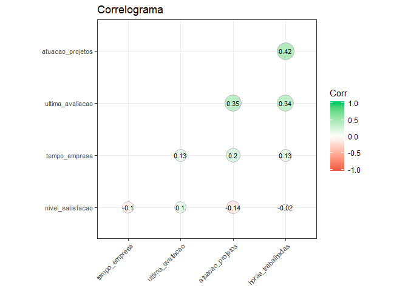
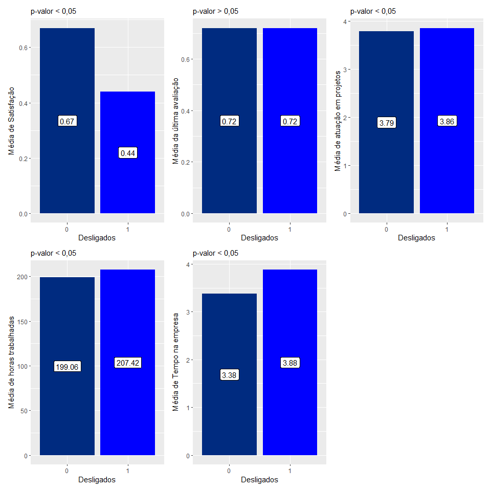
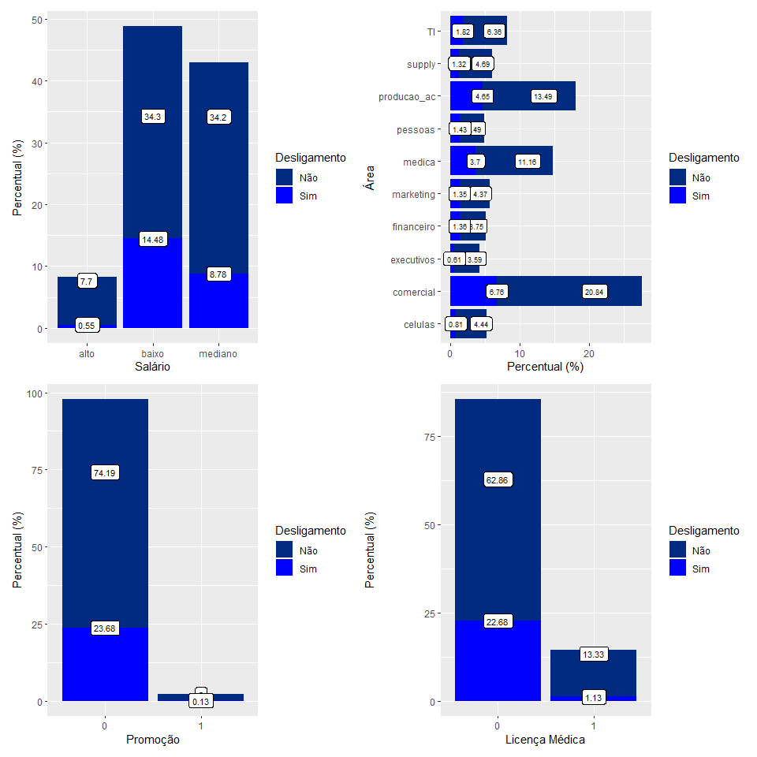

Relatórios Base Tunover
================
Rodrigo Almeida Figueira
11/06/2020

  - [Entendimento do problema](#entendimento-do-problema)
  - [Base de dados](#base-de-dados)
  - [Análise Descritiva](#análise-descritiva)
      - [Análise de correlação](#análise-de-correlação)
      - [Teste t (t-student)](#teste-t-t-student)
      - [Teste Qui-quadrado/ Fisher](#teste-qui-quadrado-fisher)
  - [Análise profunda e modelagem](#análise-profunda-e-modelagem)
      - [Regressão Logística](#regressão-logística)
  - [Resultados e Conclusão](#resultados-e-conclusão)
      - [Resultados](#resultados)
          - [Descritivos](#descritivos)
          - [Preditivos](#preditivos)
          - [Conclusão](#conclusão)
      - [Próximos passos](#próximos-passos)

-----

# Entendimento do problema

O demandante está sendo impactado com a perda de funcionários
considerados talentos, em especial aqueles com certo tempo de casa.
Existe uma base de dados composta de diversos atributos dos funcinários
em relação a empresa, inclusive aqueles que foram desligados. Espera-se
descobrir onde e se existe relação entre os atributos observados e o
desligamento destes funcionários, além de verificar seus níveis de
satisfação juntamente com suas perfomances.

-----

# Base de dados

A base de dados conta com 14.999 observações, distibuídas em diversas
variáveis como consta na tabela abaixo:

| Variáveis                  |
| :------------------------- |
| nivel\_satisfacao          |
| ultima\_avaliacao          |
| atuacao\_projetos          |
| horas\_trabalhadas         |
| tempo\_empresa             |
| licenca\_medica            |
| desligado                  |
| promocao\_ultimos\_3\_anos |
| area                       |
| salario                    |

-----

# Análise Descritiva

Nesta estapa serão feitas as primeiras análises a fim de conhecer e se
ambientar à base de dados tunover. Com isso, faremos testes que
identificam a influência entre as variáveis de acordo com o nosso
objetivo.

## Análise de correlação

Esta análise será para verificar a correlação entre variáveis
quantitativas, duas a duas. Trata-se de um método bivariado.

As variáveis quantitativas são:

| Variáveis          |
| :----------------- |
| nivel\_satisfacao  |
| ultima\_avaliacao  |
| atuacao\_projetos  |
| horas\_trabalhadas |
| tempo\_empresa     |

Tendo essa informação aplica-se o análise de correlação:

Percebe-se que as únicas variáveis que se correlacionam são:

  - Última avaliçao vs Atuação em projetos - Correlação fraca/moderada
    positiva (r = 0,35): quanto mais atuações em projetos, melhor a
    última avaliação

  - Última avaliação vs Horas Trabalhadas: Correlação fraca/moderada
    positiva (r = 0,34): quanto mais horas trabalhadas, melhor a última
    avaliação

  - Atuação em projetos vs Horas Trabalhadas: Correlação fraca/moderada
    positiva (r = 0,42): quanto mais atuações em projetos mais horas
    trabalhadas

Nenhuma das variáveis quantitativas teve um maior detaque, somente estas
com correlações fracas para moderadas. No entanto, percebe-se que há uma
tendência de melhora na última avaliação quando se atua mais em projetos
e se têm mais horas trabalhadas.

## Teste t (t-student)

Este teste comparará o grupo de funcinários deligados com aqueles que
permanecem na empreas entre difentes variáveis, validando se existe
diferença estatística entre eles. Adotou-se um nível descritivo de 5%, o
que nos dá uma confiablidade de 95% nas comparações.

Pode-se perceber que quase todas as variáveis avaliadas acima apresentam
diferença significativa (à 95% de confiança) para os grupo de
funcinários deligados e não desligados, com exceção da variável ultima
avaiação. Com isso defini-se que:

  - Os funcionários desligados são menos satisfeitos

  - A última avaliação não apresenta diferença estatística entre os
    grupos de funcionários desligados e não desligados

  - Os funcionários desligados atuaram mais em projetos do que os não
    desligados (o p-valor para esta variável foi de 0,03. Isso nos faz
    perceber que a um nível descritivo mais rigoroso - 1% ou 2% - esta
    variável não apresentaria diferença significativa entre os grupos)

  - Os funcionários desligados trabaharam mais horas do que os não
    desligados

  - O tempo de empresa dos funcionários desligados é maior do que os não
    desligados

## Teste Qui-quadrado/ Fisher

Este teste avaliará a infuência das variáveis categóricas (classe)
diante do desligamento dos funcionários. Para aquelas variáveis que
possuem 2 classes, utilizou-se o teste exato de Fisher.

Diante das tebelas acima, pode-se notar, com nível descritivo de 5%:

  - A maioria dos funcionários desligados possui baixo salário

  - Existe diferença estatística entre as áreas quando comparadas ao
    desligamento dos funcionários

  - Aqueles funcionários que foram promovidos nos últimos 3 anos
    apresentaram menos desligamentos

  - Os funcionários que usufruíram de lincença médica apresentaram menos
    desligamentos

-----

# Análise profunda e modelagem

Nesta etapa, usaremos as pré análises feitas na anteriormente para
direcionar nossa análise aprofundada. Aplicaremos um modelo multivariado
de regressão logística, para tentar prever o desligamento de um
funcionário através do seu comportamento.

#### Regressão Logística

Neste modelo selecionamos a variável independente/preditora como sendo o
**deligamento dos funcionários da empresa**. Além disso, separamos 70%
da base para treino e 30% para teste do modelo, selecionadas de forma
aleatória.

Com a aplicação do modelo para a base de treino temos as seguintes
informações:

| Variáveis                   | Razão de Chance | Razao de Chance (%) | Erro Padrão | Valor de z | p-valor |
| :-------------------------- | --------------: | ------------------: | ----------: | ---------: | ------: |
| (Intercept)                 |          0.0439 |               95.61 |        0.27 |    \-11.74 |    0.00 |
| nivel\_satisfacao           |          0.0196 |               98.04 |        0.13 |    \-31.32 |    0.00 |
| ultima\_avaliacao           |          1.6005 |               60.05 |        0.19 |       2.47 |    0.01 |
| atuacao\_projetos           |          0.6954 |               30.46 |        0.03 |    \-13.16 |    0.00 |
| horas\_trabalhadas          |          1.0035 |                0.35 |        0.00 |       5.37 |    0.00 |
| tempo\_empresa              |          1.9488 |               94.88 |        0.03 |      23.26 |    0.00 |
| licenca\_medica1            |          0.2139 |               78.61 |        0.12 |    \-13.20 |    0.00 |
| promocao\_ultimos\_3\_anos1 |          0.5931 |               40.69 |        0.41 |     \-1.27 |    0.20 |
| areacomercial               |          1.8516 |               85.16 |        0.14 |       4.26 |    0.00 |
| areaexecutivos              |          1.7527 |               75.27 |        0.22 |       2.54 |    0.01 |
| areafinanceiro              |          1.5597 |               55.97 |        0.18 |       2.45 |    0.01 |
| areamarketing               |          1.7589 |               75.89 |        0.18 |       3.11 |    0.00 |
| areamedica                  |          1.7553 |               75.53 |        0.15 |       3.70 |    0.00 |
| areapessoas                 |          1.6608 |               66.08 |        0.18 |       2.81 |    0.00 |
| areaproducao\_ac            |          1.6987 |               69.87 |        0.15 |       3.56 |    0.00 |
| areasupply                  |          1.8059 |               80.59 |        0.18 |       3.27 |    0.00 |
| areaTI                      |          1.6358 |               63.58 |        0.17 |       2.93 |    0.00 |
| salariobaixo                |          5.8943 |              489.43 |        0.17 |      10.41 |    0.00 |
| salariomediano              |          3.7644 |              276.44 |        0.17 |       7.72 |    0.00 |

Diante das informações acima, pudemos notar que, através do valor de
p-valor (Pr(\>|z|)), ao nível descritivo de 5%, a única variável que não
prediz o desligamento dos funcionários é a *promoção nos últimos 3
anos*. Ao se aplicar um olhar mais rigoroso, com nível descritivo de 1%,
além da variável citada anteriormente, a outra variável não preditora
seria a *última avaliação*. Contudo faremos a análise da razão de chance
de cada variável com oo nível descritivo padrão utilizado nas ténicas
anteriores (5%), o que nos dá um nível de 95% de confiança.

A razão de chance nos aponta a relação entre as categorias das variáveis
assumindo que todas as outras são constantes. Sendo assim, temos:

  - A cada unidade a menos do nível de satisfação, aumenta-se em 0,98
    (98%) vezes a chance de desligamento

  - A cada unidade a mais na última avaliação, aumenta-se em 1,60 (60%)
    vezes a chance de desligamento

  - Quanto menos atuaçao em projetos, há 0,3 (30%) mais chance de
    desligamento

  - Quanto mais horas trabahadas, há 0,0035 (0,35%) mais chances de
    desligamento

  - Quanto mais tempo de empresa tem o funcionário, cresce em 1,9 (95%)
    as chaces de desligamento

  - Aqueles que não usufruíram de licença médica possuem 0,78 (78%) mais
    chances de desligamento

  - A aréa de celulas é a que apresenta menos chances de desligamento e
    será a referência para avaliar as outras áreas:

*Área comercial possui 1,89 (89%) mais chances de desligamento*

*Área de executivos possui 1,75 (75%) mais chances de desligamento*

*Área financeira possui 1,56 (56%) mais chsnces de desligamento*

*Área de marketing possui 1,76 (76%) mais chances de desligamento*

*Área médica possui 1,75 (75%) mais chances de desligamento*

*Área de pessoas possui 1,66 (66%) mais chances de desligamento*

*Área de produtos ac possui 1,70 (70%) mais chances de desligamento*

*Área de supply possui 1,81 (81%) mais chances de desligamento*

*Área de TI possui 1,64 (64%) mais chances de desligamento*

  - Aqueles funcionários que apresentam salários altos são os que
    possuem menos chance de desligamento e servirão de referência para
    avaliar os outros níveis de salário:

*Os funcionários que possuem salário baixo, têm 5,89 (489%) mais chances
de desligamento*

*Os funcionários que possuem salário médio, têm 3,76 (276%) mais chances
de desligamento*

De acordo com as informações acima, aplicaremos o modelo preditivo para
verificar a precisão das nossas afirmações.

A aplicação para a base de teste gera uma matriz de confusão:

|   |    0 |    1 |
| - | ---: | ---: |
| 0 | 2086 |  843 |
| 1 |  494 | 1077 |

De acordo com a matriz de confusão acima, pode-se perceber que o modelo
possui boa precisão, igual a **70%**. Isso se deve ao fato de adotar o
ponto de corte probabilístico de 0,3 de probabilidade de ser desliado.
Ou seja, quando um funcionário apresenta mais que 0,3 de probabilidade
de desligamento, já existem fortes tendências dessa corrência.

Agora será aplicado o modelo para a base de produção. Neste caso,
utilizaremos a base completa;

|   |    0 |    1 |
| - | ---: | ---: |
| 0 | 9473 | 1955 |
| 1 | 1184 | 2387 |

Quando o modelo é aplicado à base de produção, sua precisão cresce para
**79%**, adotando os mesmos critérios para a aplicação na base de teste

# Resultados e Conclusão

Diante das informações extraídas das análises acima, podemos concluir e
direcionar a empresa em relação aos atributos que foram avaliados. Com
isso, temos o seguinte direcionamento:

## Resultados

### Descritivos

  - A empresa possui uma tendência a avaliar positivamente aqueles
    funcionários que atuam mais em projetos e trabalham mais horas,
    porém a última avaliação não influencia diretamente no desligamento
    dos funcionários

  - Os funcionários deligados trabalharam mais horas e possuem mais
    tempo de empresa

  - Os funcionários com alto salário, da área de celulas, com promoção
    nos últimos 3 anos, apresentaram menos desligamentos

### Preditivos

  - Os funcionários menos satisfeitos possuem mais chances de
    desligamento

  - A última avaliação, até certo ponto, quanto mais alta, aumenta as
    chances de desligamento

  - Os funcionários que atuam menos em projetos possuem mais chances de
    desligamento

  - Os funionários que trabalham mais horas, possuem mais chances de
    desligamento

  - Aqueles que não usufruíram de licença médica possuem mais chances de
    desligamento

  - A promoção ou não nos últimos 3 anos não apresenta riscos ao
    desligamento

  - As áreas comercial e supply são as que apresentam mais risco de
    desligamento quando comparadas a área de celulas, que é a que
    apresenta menor risco

  - Os funcionários com salários baixos e médios apresentam muito mais
    chances de desligamento quando comparados aqueles com salários altos

### Conclusão

A empresa deve atentar para o perfil de desligamento dos funcionários,
visto que esta tende a valorizar aqueles que **trabalham mais horas** e
**atuam mais em projetos**, sendo o primeiro um efeito que impulsiona o
desligamento dos funcionários enquanto segundo não é primordial para a
mesma ocorrência.

Outro ponto a se destacar é o **nível de satisfação** dos funcionários,
que quando negativo, traz grande risco de desligamento dos mesmos. Isto
pode-se dar devido a área em que o funcionário trabalha ter **baixos
salários** e já estar há muito tempo na empresa trabalhando nesta mesma
área, visto que o **tempo de empresa** impulsiona o desligamento (quanto
mais tempo de empresa maior a chance de desligamento).

Além disso, deve-se destacar se estão sendo cumpridos os direitos em
relação a **lincença médica**, visto que aqueles que não usufruíram da
mesma, possuem mais chances de desligamento.

## Próximos passos

Executar o modelo preditivo para a base de funcionários atual e tratar
os atributos que possuem destaque a fim da empresa não ser impactada com
a perda de talentos. Além disso, a empresa deve revisar seu método de
avaliação, visto que o mesmo influencia negativamente na permanência dos
funcionários.
